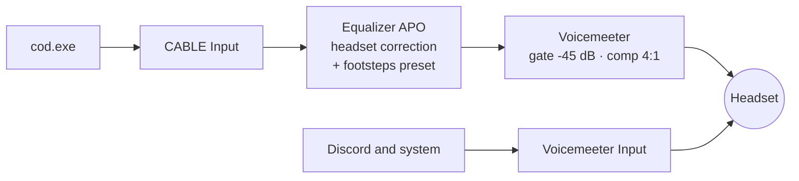

<p align="center">
  <picture>
    <source media="(prefers-color-scheme: dark)" srcset="assets/logo-dark.svg">
    <source media="(prefers-color-scheme: light)" srcset="assets/logo-light.svg">
    
  </picture>
</p>

<p align="center">
  <strong>Real Warzone optimizations. No placebo.</strong>
</p>

<p align="center">
  <a href="https://github.com/adrianlunamx/Hardline/actions/workflows/release.yml"></a>
  <a href="https://github.com/adrianlunamx/Hardline/releases/latest"></a>
  
  
  <a href="LICENSE"></a>
</p>

<p align="center">
  <a href="README.md">Español</a> · <b>English</b>
</p>

---

Hardline is a PowerShell script that tunes Windows, your GPU/CPU platform, the network, Warzone's config and your audio, so you hear footsteps first.

- **Applies** what can be changed safely and reversibly.
- **Guides you** through what can't be touched from Windows (BIOS, GPU control panel), with the menu path for **your** motherboard.
- **Records** every change with its previous value: one command reverts it.
- **Measures** before and after, and puts it in an HTML report.

> The tool itself (console output, report, docs) is in Spanish. This page is an English overview.

## Install

PowerShell **as administrator**:

```powershell
irm https://raw.githubusercontent.com/adrianlunamx/Hardline/main/install.ps1 | iex
```

Dry run first, to see what it would do without changing anything:

```powershell
& ([scriptblock]::Create((irm https://raw.githubusercontent.com/adrianlunamx/Hardline/main/install.ps1))) -DryRun
```

There is also a **GUI**: Start > Hardline > Hardline, or `install.ps1 -Gui`.

It downloads the **latest release** and verifies its SHA256 before running (`-Channel main` gets the latest `main` branch instead). It creates a Windows restore point first and installs to `%LOCALAPPDATA%\Hardline`. A checklist at the start lets you pick which modules to apply.

## What it does

| Area | Automatic | Left in the report for you |
|---|---|---|
| **Platforms** | Pick where you play (Battle.net, Steam, Xbox app). The others: processes closed, autostart removed, services disabled | |
| **Game session mode** | While Warzone is running: pauses background services, lowers browser/launcher priority, switches to the max power plan. Restores everything when you quit | |
| **Windows** | Background services, Game DVR off, Game Mode on, MMCSS, Ultimate Performance, 0.5 ms timer (Win11), widgets/Cortana off | LatencyMon if DPC spikes |
| **GPU** | Radeon, GeForce and Arc: driver age, real Resizable BAR state, recent driver crashes (TDR). HAGS off on Radeon only | Anti-Lag / Reflex / XeLL, control panel settings, undervolt |
| **CPU / RAM** | Ryzen family, SMT, chipset driver, EXPO/XMP state | PBO, Curve Optimizer -20, tRFC |
| **Advanced latency** | MSI interrupt mode for GPU, NIC and USB controllers (only where the hardware supports it); NIC interrupt moderation off, RSS on | Verify with LatencyMon |
| **Experimental** *(off by default)* | `disabledynamictick`, mouse/keyboard queue size, `Win32PrioritySeparation`. Weak evidence: measure and revert if nothing changes | |
| **Network** | DNS 1.1.1.1, NIC power saving off, autotuning, DSCP 46 QoS for `cod.exe` | Router SQM if there is bufferbloat |
| **Network diagnosis** | Packet loss and jitter to the router and to the Internet separately, bufferbloat under load (A+ to F), MTU | Hit registration is server-side; this measures what reaches the server and whether problems are at home or at your ISP |
| **Controller** | Detects controller and connection; USB power saving off for the controller and its hub; warns about Bluetooth and remapping layers (DS4Windows, reWASD, Steam Input...); trigger deadzone 0, vibration off. Built-in test measures stick drift and real update rate (Hz) | Stick deadzone from the test result, wired or official adapter |
| **Warzone** | Graphics settings in `options.*.cst`, validated against the file's own allowed values | FOV, brightness |
| **Audio** | Measured headset correction (AutoEq, ~8800 models) + footsteps EQ + compressor/gate (Voicemeeter). `Ctrl+Alt+F10` toggles the EQ in-game; a built-in A/B footstep test | Per-app routing of `cod.exe` in Windows |

## Audio



- **Footsteps EQ**: boosts 2-4 kHz (heel strike and surface texture), cuts below 500 Hz (explosions, your own gunfire).
- **No clipping**: the overlapping boosts add up to **+19 dB** at 2.8 kHz. Hardline computes the real filter response and sets the preamp (-20.5 dB for the base preset).
- **Your headset**: measured correction from [AutoEq](https://github.com/jaakkopasanen/AutoEq) for 6 bundled models or any of ~8800 by name, or drop your own Equalizer APO file in `headsets\`.
- **Zero added latency**: `-AudioMode EqOnly` skips Voicemeeter.

## Revert

```powershell
.\rollback.ps1              # last session
.\rollback.ps1 -List        # list sessions
```

Restores the exact previous value of every change (registry, services, power plan, DNS, NIC, QoS, scheduled tasks, files). Installed software (Voicemeeter, VB-CABLE, Equalizer APO, Peace) is removed from Settings > Apps.

## Anti-cheat

Hardline never touches the game process: no injection, no memory access, no priority/affinity changes, no game files. It only edits the user config the game itself stores in `Documents\Call of Duty\players`, same as the settings menu.

## Requirements

Windows 10 22H2 or 11 · PowerShell 5.1 (built in) · Administrator rights · Internet for audio components and AutoEq profiles.

## License

MIT. Headset profiles come from [AutoEq](https://github.com/jaakkopasanen/AutoEq) (MIT).
