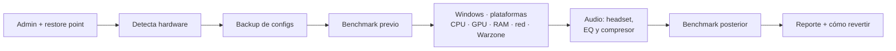
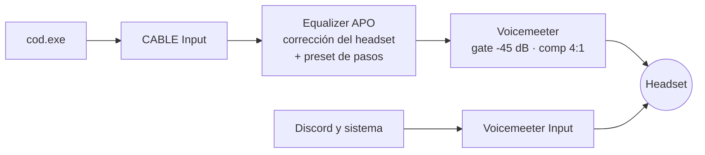

<p align="center">
  <picture>
    <source media="(prefers-color-scheme: dark)" srcset="assets/logo-dark.svg">
    <source media="(prefers-color-scheme: light)" srcset="assets/logo-light.svg">
    
  </picture>
</p>

<p align="center">
  <strong>Optimizaciones reales para Warzone. Nada de placebo.</strong>
</p>

<p align="center">
  <a href="https://github.com/adrianlunamx/Hardline/actions/workflows/release.yml"></a>
  <a href="https://github.com/adrianlunamx/Hardline/releases/latest"></a>
  
  
  <a href="LICENSE"></a>
</p>

<p align="center">
  <a href="#instalación">Instalación</a> ·
  <a href="#qué-hace">Qué hace</a> ·
  <a href="#audio-pasos-claros-explosiones-controladas">Audio</a> ·
  <a href="#revertir">Revertir</a> ·
  <a href="docs/TWEAKS_EXPLAINED.md">Cada tweak explicado</a> ·
  <a href="docs/FAQ.md">FAQ</a> ·
  <a href="README.en.md">English</a>
</p>

---

Hardline es un script de PowerShell que ajusta Windows, tu GPU y CPU, la red, la configuración de Warzone y el audio para oír pasos antes que nadie.

- **Aplica** lo que se puede hacer de forma segura y reversible.
- **Te guía** en lo que no se puede tocar desde Windows (BIOS, Adrenalin), con la ruta de menús de **tu** placa.
- **Registra** cada cambio con su valor anterior: se revierte con un comando.
- **Mide** antes y después, y te lo deja en un reporte HTML.

## Instalación

PowerShell **como administrador**:

```powershell
irm https://raw.githubusercontent.com/adrianlunamx/Hardline/main/install.ps1 | iex
```

Primero, si quieres ver qué haría sin tocar nada:

```powershell
& ([scriptblock]::Create((irm https://raw.githubusercontent.com/adrianlunamx/Hardline/main/install.ps1))) -DryRun
```

> [!NOTE]
> Descarga la **última release** y verifica su SHA256 antes de ejecutar nada. Crea un restore point, se instala en `%LOCALAPPDATA%\Hardline` y al empezar te deja marcar qué módulos aplicar. Si no abres PowerShell como admin, pide elevación (UAC) solo.

<details>
<summary><strong>Desde un clon</strong></summary>

```powershell
git clone https://github.com/adrianlunamx/Hardline.git
cd Hardline
.\install.ps1
```

</details>

<details>
<summary><strong>Opciones</strong></summary>

| Parámetro | Efecto |
|---|---|
| `-DryRun` | Detecta y muestra, no cambia nada |
| `-Unattended` | Sin preguntas (respuestas por defecto). Los instaladores de Equalizer APO y VB-CABLE siguen abriendo su ventana: combínalo con `-SkipAudio` para una ejecución sin intervención |
| `-Channel stable\|main` | `stable` (por defecto): última release con SHA256 verificado. `main`: lo último de la rama, sin verificar |
| `-GameSession Yes\|No` | Instalar o no el modo partida sin preguntar |
| `-Platform battlenet\|steam\|xbox` | Plataforma desde la que juegas (por defecto se deduce de dónde está `cod.exe` y se confirma) |
| `-Headset <id o modelo>` | Perfil incluido (`hyperx-cloud-ii`, `logitech-g-pro-x`, `steelseries-arctis-7`, `razer-blackshark-v2`, `corsair-hs80`, `astro-a40-tr`, `generic`), un archivo de `headsets\` o cualquier modelo para buscar en AutoEq (`-Headset "Kraken V3"`) |
| `-AudioMode Full\|EqOnly` | EQ + compresor, o solo EQ (sin latencia añadida) |
| `-SkipWindows` `-SkipPlatforms` `-SkipNetwork` `-SkipGame` `-SkipAudio` `-SkipBenchmark` | Omitir módulos sin pasar por el menú |
| `-BenchmarkOnly` | Medir otra vez y comparar con el benchmark previo (tras reiniciar) |
| `-Gui` | Abrir la interfaz gráfica |
| `-NetDiagOnly` | Solo el diagnóstico de red |
| `-Experimental` | Aplicar también los tweaks experimentales |
| `-SkipLatency` `-SkipNetDiag` | Omitir latencia avanzada / diagnóstico de red |
| `-SkipController` | Omitir el módulo de mando |
| `-SkipDisplay` | Omitir el módulo de pantalla |
| `-GameplayBenchOnly` | Solo medir una partida real (FPS, 1% lows, tirones) y comparar |
| `-ControllerTestOnly` | Solo el test de mando (drift, zona muerta, Hz) |

</details>

### Actualizar

Botón **Actualizar** en la interfaz (aparece solo cuando hay versión nueva; se comprueba al abrir y cada 30 minutos). Actualiza sin cerrar la ventana. En consola, `install.ps1 -Update`. Descarga la última release con SHA256 verificado y conserva backups, reportes, mediciones, perfiles y el progreso de la guía.

### Interfaz gráfica

Tras la primera instalación aparece **Inicio > Hardline > Hardline**: una ventana con los módulos en casillas, opciones (plataforma, headset, modo de audio, intensidad) y botones para **Simular**, **Aplicar**, **Medir partida**, **Guía de pasos**, **Revertir**, **Diagnóstico de red**, **Benchmark**, **Test de pasos** y **Test de mando**, con la salida en directo. También con `install.ps1 -Gui`. Ejecuta exactamente el mismo código que la consola.

### Pasos manuales: la guía

Lo que no se puede hacer desde Windows (BIOS, panel de la GPU, menús del juego) queda en una **guía de pasos**, ordenada de lo que más se nota a lo avanzado. Al terminar se abre sola: en la interfaz como asistente, un paso cada vez; en la consola, como página con casillas y la opción de ir paso a paso ahí mismo. Vuelve a ella cuando quieras desde **Inicio > Hardline > Guía de pasos**. Lo que marcas como hecho se recuerda.

### Qué pasa al ejecutarlo



## Qué hace

| Área | Automático | Te lo deja en el reporte |
|---|---|---|
| **Pantalla** | Monitor por debajo de su refresco máximo (144 Hz funcionando a 60): se sube. Optimizaciones para juegos en ventana y VRR. Aviso de overlays (Discord, RivaTuner, Overwolf, Medal...) | Límite de FPS para FreeSync/G-SYNC calculado con tu refresco |
| **Plataformas** | Eliges desde dónde juegas (Battle.net, Steam, Xbox app). Las que no usas: procesos cerrados, sin arranque automático, servicios deshabilitados | |
| **Modo partida** | Solo con Warzone abierto: pausa servicios de fondo, baja la prioridad de navegadores y launchers, activa el plan de energía máximo. Al cerrar el juego, todo vuelve | |
| **Windows** | Servicios de fondo, Game DVR off, Game Mode on, MMCSS, Ultimate Performance, timer 0.5 ms, widgets/Cortana fuera | LatencyMon si hay picos DPC |
| **Latencia avanzada** | Modo MSI de interrupciones en GPU, red y USB (solo si el hardware lo soporta); Interrupt Moderation off y RSS on en la NIC | Verificar con LatencyMon |
| **Experimental** *(desmarcado)* | `disabledynamictick`, colas de ratón/teclado, `Win32PrioritySeparation`. Evidencia débil: mide y revierte si no notas nada | |
| **CPU Ryzen** | Familia, SMT, chipset driver | PBO, Curve Optimizer -20, validación con Prime95/CoreCycler |
| **GPU** | Radeon, GeForce y Arc: driver, estado real de ReBAR/SAM, crashes TDR recientes. HAGS off solo en Radeon | Anti-Lag / Reflex / XeLL, panel del driver, undervolt |
| **RAM** | Velocidad y si EXPO/XMP está activo | tRFC con ZenTimings |
| **Red** | DNS 1.1.1.1, EEE/Green Ethernet off, autotuning, QoS DSCP 46 para `cod.exe` | SQM en el router si hay bufferbloat |
| **Diagnóstico de red** | Pérdida y jitter al router y a Internet por separado, bufferbloat bajo carga (nota A+ a F), MTU | Qué falla y dónde: casa o proveedor |
| **Mando** | Detecta mando y conexión; ahorro de energía USB off en el mando y su hub; avisa de Bluetooth y de capas de remapeo (DS4Windows, reWASD, Steam Input...); zona muerta de gatillos 0, vibración off. Test de drift y Hz | Zona muerta de sticks según el test, cable o adaptador oficial |
| **Warzone** | Ajustes gráficos en `options.*.cst` / `adv_options.ini`, validados contra el propio archivo. Reflex + Boost, Anti-Lag 2 o XeLL según tu GPU; pantalla completa exclusiva | FOV, brillo, Anti-Lag 2 |
| **Audio** | Corrección medida de tu headset + EQ de pasos + compresor/gate. Panel del EQ (encender/apagar, intensidad), `Ctrl+Alt+F10` en partida y test de pasos A/B | Enrutado de `cod.exe` en Windows |

Lo que Hardline **no** hace, y por qué: [Lo que Hardline NO hace](docs/TWEAKS_EXPLAINED.md#lo-que-hardline-no-hace).

## Qué mejora

Referencia: Ryzen 5 7600X + RX 6650 XT, Warzone 1080p.

| | De dónde sale |
|---|---|
| **FPS** | Sobre todo de la configuración gráfica (todo bajo salvo texturas) y de EXPO/PBO. Los tweaks de Windows solos mueven poco la media. |
| **1% lows y frametimes** | Servicios de fondo, Game DVR, plan de energía y timer atacan los picos, no la media. Es lo que más se nota al jugar. |
| **Input lag** | Anti-Lag 2 en el juego, HAGS off, sin limitadores por software. |
| **Audio** | Pasos a más distancia, explosiones que no lo tapan todo. |

| **Fluidez visible** | Refresco del monitor al máximo: si estaba a 60 Hz en un monitor de 144, es el cambio más grande que vas a notar. |

Hardline no publica cifras que no haya medido en tu equipo. Para verlo en el tuyo:

1. **Medir partida** antes de aplicar (60 s jugando, en el campo de tiro o en un modo concreto).
2. **Aplicar**, reiniciar.
3. **Medir partida** otra vez en el mismo sitio. Sale la tabla antes/después de FPS, 1% lows y tirones, y si la diferencia es real o ruido entre partidas.

## Audio: pasos claros, explosiones controladas



- **EQ de pasos**: realza 2-4 kHz (tacón y superficie) y recorta por debajo de 500 Hz (explosiones, disparos propios).
- **Sin clipping**: los realces solapados suman **+19 dB** en 2.8 kHz. Hardline calcula la respuesta real de los filtros y ajusta el preamp (-20.5 dB en el preset base, no los -4 dB habituales en otras guías).
- **Compresor**: baja los picos y sube lo que no lo es. Neto: pasos más altos, explosiones más bajas.
- **Solo el juego**: Discord y el resto del sistema no pasan por el EQ.
- **Sin latencia añadida**: `-AudioMode EqOnly` quita Voicemeeter y deja solo el EQ.
- **Panel del EQ**: Inicio > Hardline > *Hardline EQ*. Enciende y apaga el EQ y cambia entre intensidad Completa y Moderada al momento, sin administrador.
- **Comparar al momento**: `Ctrl+Alt+F10` enciende/apaga el EQ en partida (un pitido agudo = encendido, dos graves = apagado). Inicio > Hardline > *test de pasos* reproduce la misma escena con el EQ apagado y encendido.

### Tu headset

1. **Detectado o elegido** (6 incluidos): descarga su corrección medida de [AutoEq](https://github.com/jaakkopasanen/AutoEq) (oratory1990, crinacle, Rtings) y pone encima el preset de pasos. Sin internet, usa un perfil aproximado.
2. **Otro modelo**: escribe el nombre ("Kraken V3", "Arctis Nova Pro") y elige entre ~8800 perfiles medidos.
3. **Manual**: baja el perfil de [autoeq.app](https://autoeq.app) (formato Equalizer APO) y déjalo en `headsets\`.

Todo lo descargado se queda en `headsets\`: la próxima vez funciona sin conexión.

### Si ya tenías un audio personalizado

Antes de instalar, Hardline busca lo que haya: un Equalizer APO con tu propia configuración, Art Tune, HeSuVi, Peace, FxSound, Boom 3D, ViPER4Windows, Razer Surround, Nahimic, Sonar, Voicemeeter Banana. Si encuentra algo, lo limpia primero:

- La configuración anterior de Equalizer APO se aparta a `config\antes_de_hardline\`. No se pierde y el rollback la devuelve.
- Art Tune y HeSuVi se apartan enteros (biblioteca, VST, iconos, LEQ Control Panel, accesos directos) a `backups\<sesión>\apartado\`, y VB-CABLE y Voicemeeter recuperan sus nombres e iconos de fábrica. El rollback lo devuelve todo.
- Los programas que se apilan con el EQ se desinstalan con su propio desinstalador. Te pregunta uno a uno; en la interfaz decide la casilla "desinstalarlo antes".
- Si Equalizer APO está activo en más de un dispositivo, te dice cuáles desmarcar.

Detalles: [audio en TWEAKS_EXPLAINED](docs/TWEAKS_EXPLAINED.md#audio).

## Modo partida

Una tarea al iniciar sesión vigila si Warzone está abierto. Mientras lo está:

- **Servicios** (Windows Search, SysMain, Windows Update, BITS, Delivery Optimization, cola de impresión): se detienen solo si estaban en marcha y se reanudan al cerrar el juego.
- **Procesos de fondo** (navegadores, Spotify, OneDrive, launchers): prioridad "por debajo de lo normal".
- **Plan de energía máximo** solo durante la partida, si lo eliges: en reposo el PC consume y se calienta menos.

El juego no se toca. Todo es editable en `config\gamesession.json` y queda registrado en `logs\gamesession.log`. Si el PC se apaga a mitad de partida, al volver a iniciar sesión restaura lo pendiente.

## Revertir

```powershell
.\rollback.ps1              # última sesión
.\rollback.ps1 -All         # todas las sesiones: como antes de Hardline
.\rollback.ps1 -List        # ver sesiones
.\rollback.ps1 -Stamp 2025-01-15_14-30
```

Restaura el valor exacto anterior de cada cambio: registro, servicios, plan de energía, DNS, NIC, QoS, tareas y archivos. También está el restore point de Windows (`Hardline_<fecha>`).

> [!TIP]
> Si instalaste con `irm | iex`, `rollback.ps1` está en `%LOCALAPPDATA%\Hardline`. El rollback no desinstala software: Voicemeeter, VB-CABLE y Equalizer APO se quitan desde Configuración > Aplicaciones. Lo que la limpieza de audio desinstaló a petición tuya (Peace, FxSound...) tampoco se reinstala.

## Anticheat

Hardline no toca el proceso del juego, no inyecta nada y no modifica archivos del juego. Solo edita la configuración de usuario que el propio juego guarda en `Documentos\Call of Duty\players`, igual que el menú de ajustes. Más en la [FAQ](docs/FAQ.md#ricochet).

## Requisitos

- Windows 10 22H2 o Windows 11
- PowerShell 5.1 (viene con Windows; desde PowerShell 7 se relanza en 5.1)
- Permisos de administrador
- Internet para el audio (descarga los instaladores oficiales y los perfiles de AutoEq)

## Documentación

| | |
|---|---|
| [TWEAKS_EXPLAINED.md](docs/TWEAKS_EXPLAINED.md) | Qué hace cada cambio y por qué |
| [SUPPORTED_HARDWARE.md](docs/SUPPORTED_HARDWARE.md) | Qué se detecta y qué se ajusta en cada plataforma |
| [FAQ.md](docs/FAQ.md) | Anticheat, rollback, audio, problemas comunes |
| [CHANGELOG.md](CHANGELOG.md) | Versiones |
| [CONTRIBUTING.md](CONTRIBUTING.md) | Cómo probar, reglas y cómo publicar una versión |

## Licencia

MIT. Ver [LICENSE](LICENSE). Los perfiles de headset descargados vienen de [AutoEq](https://github.com/jaakkopasanen/AutoEq) (MIT).
